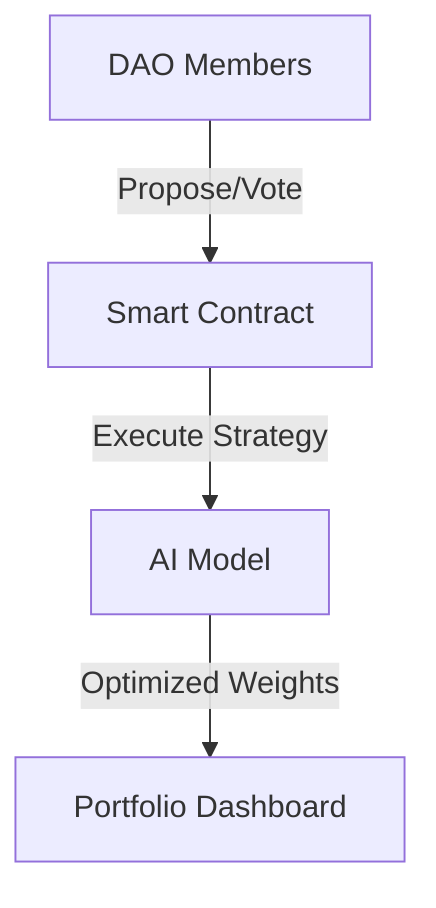

# -DAO-Powered-Finance
AI for Portfolio Optimization, 
Here's a concise and professional **README.md** summary for your GitHub repository. You can customize it further based on your project’s specifics:

---

# DAO-Powered Finance: AI-Driven Portfolio Optimization 🚀

A decentralized finance (DeFi) system combining **DAO governance** and **AI-powered portfolio optimization**. Members collaboratively decide investment strategies via a DAO, while an AI model optimizes portfolios using Modern Portfolio Theory (MPT).

[](https://opensource.org/licenses/MIT)
[](https://www.python.org/)
[](https://soliditylang.org/)

---

## 🔍 Overview
- **DAO Governance**: Stakeholders propose and vote on portfolio strategies using Ethereum smart contracts.
- **AI Optimization**: A Python-based model optimizes asset allocation using historical returns and risk preferences.
- **Decentralized**: Built on Ethereum (or testnets like Goerli) for transparency and trustlessness.

---

## 🛠️ Tech Stack
- **Blockchain**: Solidity, Hardhat, Ethers.js
- **AI/Backend**: Python, FastAPI, NumPy, SciPy
- **Frontend**: Streamlit/React, Web3.js
- **Tools**: Git, VS Code, Infura

---

## ✨ Features
1. **Propose Strategies**: DAO members create portfolio allocation proposals.
2. **Vote Securely**: On-chain voting using ERC-20 tokens or NFTs.
3. **AI Execution**: Winning strategies are optimized by the AI model.
4. **Real-Time Dashboard**: Monitor portfolios and performance.

---

## 🚀 Quick Start

### Prerequisites
- Node.js ≥ 16.x
- Python ≥ 3.8
- MetaMask (for DAO interaction)

### Installation
1. Clone the repo:
   ```bash
   git clone https://github.com/yourusername/dao-finance-demo.git
   cd dao-finance-demo
   ```

2. Install blockchain dependencies:
   ```bash
   npm install
   ```

3. Set up the Python backend:
   ```bash
   cd backend
   python -m venv venv
   source venv/bin/activate  # Windows: venv\Scripts\activate
   pip install -r requirements.txt
   ```

### Usage
1. Deploy the DAO smart contract:
   ```bash
   npx hardhat run scripts/deploy.js --network goerli
   ```

2. Start the AI backend:
   ```bash
   uvicorn server:app --reload
   ```

3. Launch the frontend (Streamlit):
   ```bash
   streamlit run app.py
   ```

---

## 📈 Architecture


---

## 🤝 Contributing
1. Fork the repository.
2. Create a feature branch: `git checkout -b feature/your-feature`.
3. Commit changes: `git commit -m 'Add your feature'`.
4. Push to the branch: `git push origin feature/your-feature`.
5. Open a Pull Request.

---

## 📜 License
Distributed under the MIT License. See `LICENSE` for details.

---

## 🌟 Acknowledgements
- [Hardhat](https://hardhat.org/) for Ethereum development.
- [FastAPI](https://fastapi.tiangolo.com/) for backend APIs.
- Modern Portfolio Theory (MPT) for optimization logic.

---

Feel free to tweak this template! Let me know if you need help adding screenshots, GIFs, or more detailed sections. 🚀
